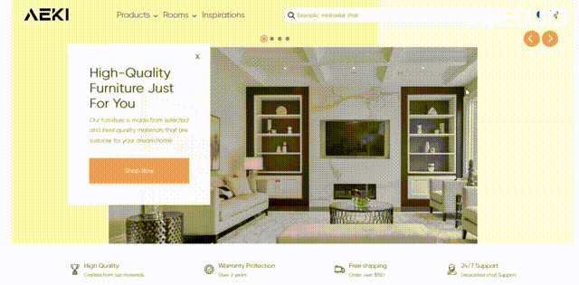
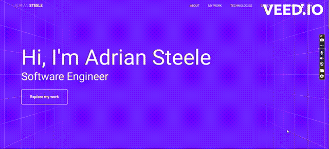
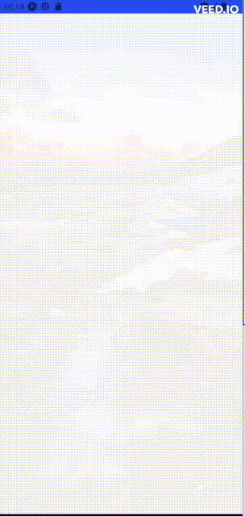
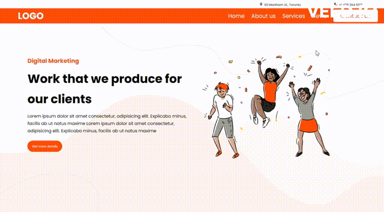
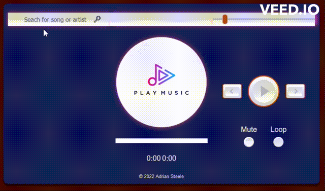

  
  
  
  

Full-Stack Software Engineer at 100Devs, I am motivated by the power of technology as a tool for positive change, with a background in development, business, and account management.

See [my website](https://adrian-portfolio-phi.vercel.app) for more information!

<h1 align="center">Projects</h1>
<table bordercolor="#66b2b2">
  
  <tr>
    <td width="50%" valign="top">
      <h3 align="center">AEKI Furniture Store</h3>
         
        
         
        

    
  
      

        
<strong>HTML, Sass, Javascript, Axios, Vercel</strong> - A beautiful, fully responsive furniture store with a shopping cart, English/French toggle, and connected to Unsplash API.

    </td>
    <td width="50%" valign="top">
        <h3 align="center">Portfolio Site</h3>
       
        
       
        

  
  
  </a>
      

        
<strong>HTML, CSS, JavaScript</strong> - My portfolio site. Fully responsive and using BEM methodology for the CSS classes. You can contact me via the messaging form in the website.

    </td>
  </tr>
  
  <tr>
    <td width="50%" valign="top">
      <h3 align="center">Meals App (Digital Cook Book)</h3>
       
        
       
        

  
      

        
<strong>React Native, JavaScript, Expo</strong> - A simple, intuitive, digital cook book with multiple food categories and instructions on how to prepare the meals. Built for Android and iOS.

    </td>
    <td width="50%" valign="top">
      <h3 align="center">Guess My Number</h3>
         
        
         
        

  
      

        
<strong>React Native, TypeScript</strong> - Choose a number between 1 and 10,000 and keep the app guessing. The one with the least number of guesses is the true hero!

    </td>
  </tr>

  <tr>
    <td width="50%" valign="top">
      <h3 align="center">Digital E-Commerce Site</h3>
       
        
       
        

  
  
      

        
<strong>HTML, CSS, JavaScript</strong> - A modern, fully responsive, multi-purpose website with animated icons, a perpetual slider, and an image gallery with animation effects upon mouse hover. The site can be quickly repurposed and scaled to almost any type of small e-commerce business.

    </td>
    <td width="50%" valign="top">
      <h3 align="center">Music Sampler</h3>
         
        
         
        

  
  
      

        
<strong>HTML, CSS, JavaScript, Axios</strong> - Search for any song in Shazam's database and get up to 5 clips of 1 minute and 30 second samples. The app contains play/pause, previous/next features, volume rocker, repeat, mute, progress bar and seeker. 

    </td>
  </tr>
</table>

<h1 align="center">Technologies</h1>

    
    
    
    
    
    
    
    
    
    
    
    
    
    
    

---

<h1 align="center">Connect</h1>

  
  
  
  

